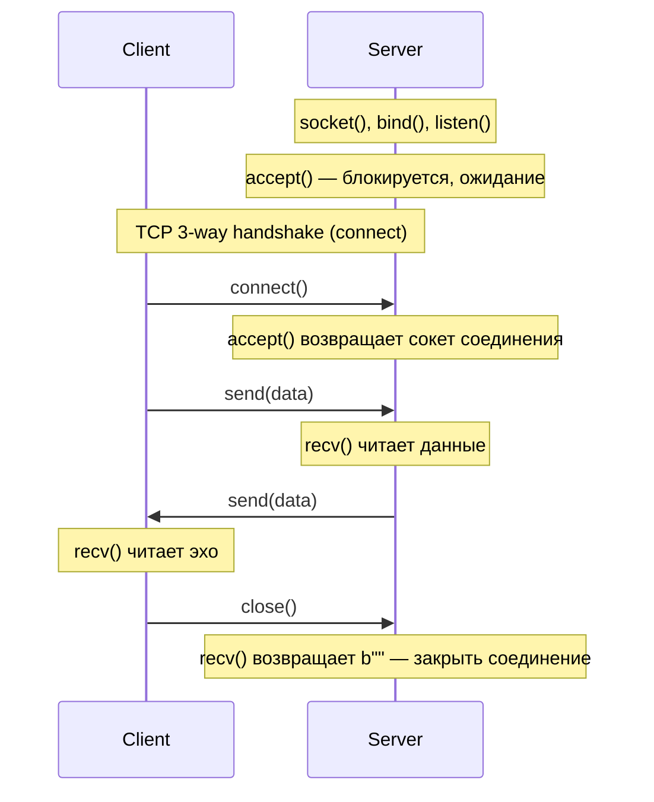
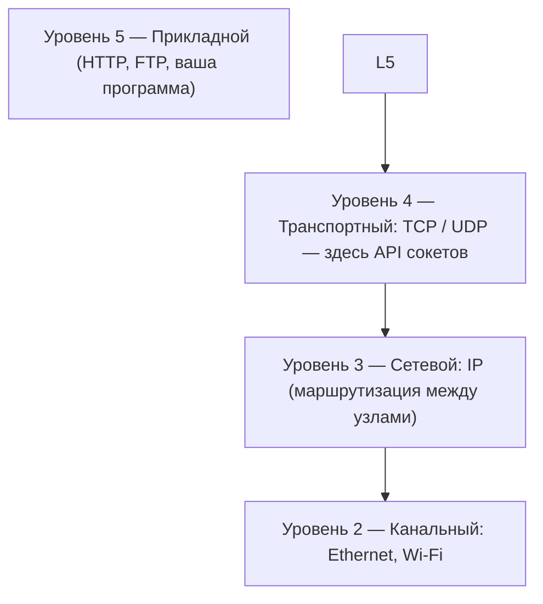

# Основы сетевого программирования с сокетами

**Лабораторная работа (5 лабораторных): TCP echo, pickle, UDP echo, JSON «Банк»**

В работе изучается обмен данными по сети с помощью **сокетов** в Python. Вы выполните **не более 5 лабораторных**: в каждой — одно приложение (или два небольших в одной теме). Итог: TCP-сервер и клиент, кодирование, таймауты, pickle, UDP, JSON.

| Параметр | Значение |
|----------|----------|
| **Источник** | [fa-python-network/1_echo_server](https://github.com/fa-python-network/1_echo_server), лекции по сокетам (koroteev.site) |
| **Порты** | `9090` TCP echo / pickle · `9091` UDP · `9092` банк |
| **Объём** | 5 лабораторных, порядок: TCP echo → многоразовый сервер → таймауты → pickle + UDP → банк JSON |

> **Кратко.** 5 лабораторных (TCP echo → многоразовый сервер → таймауты → pickle + UDP → банк JSON).

> **Правило лаборатории.** Компьютеры общие. После проверки преподавателем удалите папку `~/socket` (см. [Очистка после сдачи](#очистка-после-сдачи-обязательно)).

---

## Содержание

| Раздел | Описание |
|--------|----------|
| [Как пользоваться](#как-пользоваться) | Порядок выполнения работы |
| [Предварительные требования](#предварительные-требования) | Python, терминал, чек-лист |
| [Структура папок и сдача работы](#структура-папок-и-сдача-работы) | Папки, `result.txt`, git, очистка |
| [1. Базовые понятия](#1-базовые-понятия) | Сокеты, порты, TCP, UDP |
| [2. Лабораторные 1–5](#2-лабораторные-15) | Код всех пяти лабораторных |
| [2c. Упражнения](#2c-упражнения-по-желанию) | Заполнить пропуски (по желанию) |
| [Интерактивные вопросы (MCQ)](#интерактивные-вопросы-mcq) | 20 вопросов с выбором ответа (открыть в браузере) |
| [3. Контрольные вопросы](#3-контрольные-вопросы-и-ответы) | Вопросы и ответы |

---

## Интерактивные вопросы (MCQ)

12 вопросов с выбором одного ответа для самопроверки. Откройте файл в браузере: при выборе неверного ответа он подсвечивается красным, правильный ответ — зелёным.

| Файл | Описание |
|------|----------|
| [mcq-ru.html](mcq-ru.html) | Интерактивные вопросы (откройте в браузере) |

> **Как использовать.** Сохраните или клонируйте репозиторий, откройте `mcq-ru.html` в браузере. Ответы и формулировки соответствуют материалу лабораторной работы.

---

## Как пользоваться

1. **Создайте** папку `~/socket` и подпапки для **5 лабораторных** (см. [Структура папок](#требуемая-структура-папок)).
2. **Прочитайте** раздел 1 (Базовые понятия).
3. **Выполняйте** лабораторные 1–5 по порядку. Сервер запускайте первым, клиент — во втором терминале. Вывод сохраняйте в `result.txt`.
4. **Ответьте** на контрольные вопросы раздела 3.
5. **Отправьте** `~/socket` в репозиторий и покажите URL преподавателю.
6. **После проверки** удалите `~/socket` на компьютере лаборатории.

---

## Предварительные требования

| Требование | Описание |
|------------|----------|
| **Python 3.x** | Достаточно стандартной библиотеки, дополнительные пакеты не требуются |
| **Знания** | Базовые: функции, циклы, `input()`, исключения |
| **Терминал** | Два окна одновременно (сервер и клиент) |

### Чек-лист перед началом

Перед началом убедитесь:

- [ ] Установлен Python 3.x (`python3 --version` или `python --version`).
- [ ] Можно открыть два окна терминала (для сервера и клиента).
- [ ] Создана папка `~/socket` и 5 подпапок лабораторных.
- [ ] Порты 9090, 9091, 9092 свободны (остановите предыдущий сервер перед новым).

---

## Цели обучения

К концу работы студент сможет:

| № | Цель |
|---|------|
| 1 | Объяснить роль **сокета** и различие между слушающим сокетом и сокетом соединения. |
| 2 | Написать минимальный TCP-сервер (bind, listen, accept, recv, send, close) и соответствующий клиент (connect, send, recv, close). |
| 3 | Объяснить, зачем данные нужно **кодировать** перед отправкой и **декодировать** после приёма. |
| 4 | Сделать сервер **многоразовым** с помощью цикла по `accept()`, применить **SO_REUSEADDR** и **settimeout**. |
| 5 | Передавать объект Python по TCP с помощью **pickle** и структурированный запрос/ответ с помощью **JSON**. |
| 6 | Написать простой **UDP** echo-сервер и клиент с `SOCK_DGRAM`, `recvfrom` и `sendto`. |
| 7 | Указать, какие вызовы сокетов только у сервера (`bind`, `listen`, `accept`), а какие только у клиента (`connect`). |

---

## Структура папок и сдача работы

### Где работать

Вся работа выполняется в папке `socket` в **домашнем каталоге** (`~/socket`). Создайте её перед началом:

```bash
mkdir ~/socket
cd ~/socket
```

### Требуемая структура папок

Создайте **5 подпапок** (по одной на лабораторную). Сохраняйте структуру:

```text
~/socket/
    lab01_tcp_echo_one/           # Лаб. 1: один клиент, одно сообщение
        server.py
        client.py
        result.txt
    lab02_tcp_echo_reusable/      # Лаб. 2: много сообщений, многоразовый сервер
        server.py
        client.py
        result.txt
    lab03_tcp_echo_timeouts/      # Лаб. 3: SO_REUSEADDR и таймауты
        server.py
        client.py
        result.txt
    lab04_pickle_and_udp/         # Лаб. 4: pickle + UDP (два приложения)
        pickle/
            server.py
            client.py
        udp/
            server.py
            client.py
        result.txt                 # вывод обоих приложений
    lab05_bank_json/              # Лаб. 5: банк по JSON
        server.py
        client.py
        result.txt
```

### result.txt — как сохранять вывод

Запустите сервер и клиент, затем вставьте вывод обоих терминалов в `result.txt`. Пример для лабораторной 1:

```text
=== терминал сервера ===
server is listening
new client accepted ('127.0.0.1', 54321)
received data hello

=== терминал клиента ===
echo hello
```

> **Требование.** Файл `result.txt` — **в каждой лабораторной**. Вставьте вывод сервера и клиента; так преподаватель проверяет выполнение.

### Отправка в удалённый репозиторий (обязательно)

После выполнения всех 5 лабораторных отправьте папку `socket` в репозиторий GitHub или GitLab:

```bash
cd ~/socket
git init
git add .
git commit -m "Лабораторная: основы сетевого программирования с сокетами — выполнено"
git branch -M main
git remote add origin https://github.com/VASH_LOGIN/VASH_REPO.git
git push -u origin main
```

> **Важно.** Подставьте вместо `VASH_LOGIN` и `VASH_REPO` свой логин и имя репозитория. Создайте пустой репозиторий на GitHub/GitLab **до** выполнения `git push`.

Покажите преподавателю URL репозитория (например, `https://github.com/VASH_LOGIN/socket`).

### Очистка после сдачи (обязательно)

> **Правило.** Компьютеры в лаборатории общие; одной машиной пользуются несколько групп. После того как преподаватель проверил работу и выставил оценку, вы **обязаны удалить** папку `~/socket` на компьютере лаборатории. Это даёт следующей группе начать с чистого состояния и исключает путаницу или использование чужого кода. Копия в репозитории остаётся основным отчётом; удаление касается только локального компьютера в лаборатории.

**Linux / macOS:**

```bash
rm -rf ~/socket
```

---

## 1. Базовые понятия

### Сетевые приложения и сокеты

**Сетевые приложения** обмениваются данными по сети (с другими приложениями или между частями одного приложения). Большинство использует **TCP/IP**.

**Сокет** — это **программный интерфейс** на границе между прикладным уровнем (L5) и транспортным уровнем (L4) модели OSI. Сокеты предоставляются ОС; дополнительное ПО не требуется.

- Сокет задаётся парой **(IP-адрес, порт)**.
- **TCP-соединение** использует два сокета: один у клиента, один у сервера (**сокет соединения**, возвращаемый `accept()`).
- **Сервер:** привязывается к порту, **слушает** и **принимает** соединения. **Клиент:** **подключается** к (хост, порт).

В Python используется стандартный модуль **`socket`**; сокет создаётся вызовом `socket.socket()`.

### Порты

**Порт** — это 16-битное число (0–65535), идентифицирующее приложение на узле. Существует 65 536 TCP-портов и 65 536 UDP-портов (раздельно). Порты **0–1023** — общеизвестные (например 80, 443, 22) и обычно требуют прав администратора; используйте порты из диапазона **1024–65535** (например 9090). Сервер **привязывает** сокет к порту через `bind()`; если порт занят, `bind()` завершается ошибкой. Всегда **закрывайте** сокеты по окончании работы, иначе порт может остаться занятым (например, состояние TIME_WAIT). Файрволы могут блокировать порты.

### TCP: как происходит обмен данными

**Сервер:** `socket()` → `bind(host, port)` → `listen()` → `accept()` (блокируется до подключения клиента) → используйте возвращённый сокет соединения для `recv()` / `send()` → `close()` сокета соединения.

**Клиент:** `socket()` → `connect(host, port)` → `send()` / `recv()` → `close()`.

`bind(('', port))` с пустой строкой означает «все интерфейсы». **accept()** и **recv()** — **блокирующие**; **send()** может блокироваться при переполнении буфера отправки.

TCP даёт **поток байтов**, а не отдельные сообщения. Вы читаете некоторое количество байтов; встроенных границ сообщений нет. Для **текста** используйте **encode()** перед отправкой и **decode()** после приёма (одинаковая кодировка, например UTF-8, на обеих сторонах). Если обе стороны сначала вызывают **recv()**, возникает взаимная блокировка; обычно **сначала отправляет клиент**, затем сервер принимает и отвечает.

> **Примечание (поток байтов TCP).** `recv(n)` может вернуть **меньше n байтов** — ОС отдаёт столько, сколько доступно, но не более n. Для коротких сообщений достаточно одного вызова; для больших данных нужно читать в цикле до полного сообщения (например, по префиксу длины или разделителю).



> **Замечание.** `accept()` — **локальный вызов ядра**; он не отправляет сообщение клиенту. Трёхстороннее TCP-рукопожатие (SYN, SYN-ACK, ACK) выполняет ОС при вызове клиентом `connect()`. Вызов `accept()` лишь возвращает серверному процессу новый сокет соединения после завершения рукопожатия.

### Улучшения

- **Многоразовый сервер:** Поместите «accept → обработка → закрытие соединения» в цикл **while True**, чтобы сервер принимал следующего клиента после отключения текущего.
- **Избежать бесконечной блокировки:** Используйте **sock.settimeout(секунды)**; тогда **accept()** и **recv()** при истечении времени возбуждают **socket.timeout** — обработайте исключение.
- **Порт «уже занят» после перезапуска:** Перед **bind()** установите **SO_REUSEADDR**: `sock.setsockopt(socket.SOL_SOCKET, socket.SO_REUSEADDR, 1)`.
- **Передача объектов:** По сокетам передаются байты. Чтобы отправить объект Python (например, словарь), **сериализуйте** его: **pickle.dumps(obj)** перед отправкой, **pickle.loads(bytes)** после приёма. Pickle используйте только с **доверенными** узлами; для недоверенных данных применяйте JSON.

> **Примечание (порты).** После закрытия сокета порт может оставаться в состоянии **TIME_WAIT** некоторое время. `SO_REUSEADDR` позволяет снова привязаться к тому же порту сразу (например, после перезапуска сервера).

### TCP и UDP

| Характеристика | TCP (SOCK_STREAM) | UDP (SOCK_DGRAM) |
|----------------|-------------------|------------------|
| Соединение | Да (connect → поток → close) | Нет |
| Сервер | listen, accept, recv/send по соединению | bind, recvfrom, sendto |
| Доставка | Надёжная, с сохранением порядка | Без гарантий |
| Типичное применение | HTTP, большинство приложений | Когда важнее скорость, чем надёжность |

---

## 2. Лабораторные 1–5

Сначала всегда запускайте **сервер**, затем **клиент**.

| Порт | Назначение |
|------|------------|
| **9090** | TCP echo (лаб. 1–3), pickle (лаб. 4) |
| **9091** | UDP echo (лаб. 4) |
| **9092** | Банк JSON (лаб. 5) |

---

### Лабораторная 1: Один клиент, одно сообщение

| Лабораторная 1 | Один клиент, одно сообщение (минимальный TCP echo) |
|----------------|----------------------------------------------------|

Сервер принимает одно соединение, получает до 1 КБ, возвращает эхо, закрывает соединение и завершается. Минимум: один запрос — один ответ.

**Сервер** (`lab01_tcp_echo_one/server.py`):

```python
import socket

sock = socket.socket()
sock.bind(('', 9090))
sock.listen(1)
print("server is listening")
conn, addr = sock.accept()
print("new client accepted", addr)
data = conn.recv(1024)
print("received data", data.decode())
conn.send(data)
conn.close()
sock.close()
```

**Клиент** (`lab01_tcp_echo_one/client.py`):

```python
import socket

sock = socket.socket()
sock.connect(('localhost', 9090))
sock.send(b"hello")
data = sock.recv(1024)
sock.close()
print("echo", data.decode())
```

---

### Лабораторная 2: Много сообщений и многоразовый сервер

| Лабораторная 2 | Много сообщений до `exit`, сервер принимает следующих клиентов (цикл `accept`) |
|----------------|---------------------------------------------------------------------------------|

Один клиент может отправлять много строк (до `exit`); после отключения клиента сервер ждёт следующего (цикл по `accept()`).

**Сервер** (`lab02_tcp_echo_reusable/server.py`):

```python
import socket

sock = socket.socket()
sock.bind(('', 9090))
sock.listen(1)
print("server is listening")
while True:
    conn, addr = sock.accept()
    print("new client accepted", addr)
    while True:
        data = conn.recv(1024)
        if not data:
            break
        print("received", data.decode())
        if data.strip().lower() == b"exit":
            break
        conn.send(data)
    conn.close()
    print("client left, waiting for next")
```

**Клиент** (`lab02_tcp_echo_reusable/client.py`):

```python
import socket

sock = socket.socket()
sock.connect(('localhost', 9090))
while True:
    msg = input("message (exit to quit): ")
    sock.send(msg.encode())
    if msg.strip().lower() == "exit":
        break
    data = sock.recv(1024)
    print("echo", data.decode())
sock.close()
```

---

### Лабораторная 3: SO_REUSEADDR и таймауты

| Лабораторная 3 | SO_REUSEADDR и таймауты (accept/recv не блокируются бесконечно) |
|----------------|------------------------------------------------------------------|

SO_REUSEADDR даёт возможность снова занять порт после перезапуска; settimeout ограничивает ожидание accept/recv, чтобы сервер не зависал.

**Сервер** (`lab03_tcp_echo_timeouts/server.py`):

```python
import socket

sock = socket.socket()
sock.setsockopt(socket.SOL_SOCKET, socket.SO_REUSEADDR, 1)
sock.bind(('', 9090))
sock.listen(1)
print("server is listening on 9090")
while True:
    try:
        sock.settimeout(30)
        conn, addr = sock.accept()
        sock.settimeout(None)
        conn.settimeout(60)
        print("new client", addr)
        while True:
            try:
                data = conn.recv(1024)
            except socket.timeout:
                print("timeout, closing connection")
                break
            if not data:
                break
            print("received", data.decode())
            if data.strip().lower() == b"exit":
                break
            conn.send(data)
        conn.close()
        print("client left")
    except socket.timeout:
        print("no client, listening again")
    except KeyboardInterrupt:
        print("server stop")
        break
sock.close()
```

**Клиент** (`lab03_tcp_echo_timeouts/client.py`):

```python
import socket

sock = socket.socket()
sock.settimeout(10)
try:
    sock.connect(('localhost', 9090))
    msg = input("message (exit to quit): ")
    sock.send(msg.encode())
    if msg.strip().lower() != "exit":
        data = sock.recv(1024)
        print("echo", data.decode())
except socket.timeout:
    print("timeout")
except ConnectionRefusedError:
    print("server not running")
finally:
    sock.close()
```

---

### Лабораторная 4: Pickle и UDP (два приложения в одной папке)

| Лабораторная 4 | Pickle (TCP, порт 9090) и UDP echo (порт 9091) в одной папке |
|----------------|---------------------------------------------------------------|

В одной лабораторной два небольших приложения: **pickle-эхо** (порт 9090) и **UDP-эхо** (порт 9091). Положите код в подпапки `pickle/` и `udp/`, один `result.txt` с выводом обоих.

**4.1 Pickle** (`lab04_pickle_and_udp/pickle/`) — передача словаря по TCP: `pickle.dumps(obj)` → байты, `pickle.loads(bytes)` → объект.

> **Безопасность.** Pickle используйте только с **доверенными** узлами (свой клиент и сервер). При десериализации возможен произвольный код; для недоверенных данных применяйте JSON.

**Сервер** (порт 9090):

```python
import socket, pickle
sock = socket.socket()
sock.bind(('', 9090))
sock.listen(1)
conn, addr = sock.accept()
data = conn.recv(4096)
conn.send(data)
conn.close()
sock.close()
```

**Клиент:**

```python
import socket, pickle
sock = socket.socket()
sock.connect(('localhost', 9090))
sock.send(pickle.dumps({"name": "alice", "n": 42}))
print("echo", pickle.loads(sock.recv(4096)))
sock.close()
```

**4.2 UDP** (`lab04_pickle_and_udp/udp/`) — протокол без установления соединения: `recvfrom()` / `sendto()`, порт 9091, **SOCK_DGRAM**.

**Сервер:**

```python
import socket
sock = socket.socket(socket.AF_INET, socket.SOCK_DGRAM)
sock.bind(('', 9091))
while True:
    data, addr = sock.recvfrom(1024)
    sock.sendto(data, addr)
```

**Клиент:**

```python
import socket
sock = socket.socket(socket.AF_INET, socket.SOCK_DGRAM)
sock.sendto(b"hello udp", ('localhost', 9091))
print("echo", sock.recvfrom(1024)[0].decode())
sock.close()
```

---

### Лабораторная 5: Банк (TCP + JSON)

| Лабораторная 5 | Банк: запрос–ответ по JSON (balance / deposit / withdraw), порт 9092 |
|----------------|---------------------------------------------------------------------|

Клиент отправляет JSON-запрос (balance / deposit / withdraw), сервер отвечает JSON. Порт **9092**.

<details>
<summary><strong>Сервер</strong> <code>lab05_bank_json/server.py</code> (нажмите, чтобы развернуть код)</summary>

```python
import socket
import json


class Bank:
    """Хранит баланс счёта и предоставляет три операции."""

    def __init__(self, initial=0):
        self._balance = initial

    def balance(self):
        return self._balance

    def deposit(self, amount):
        self._balance += amount
        return self._balance

    def withdraw(self, amount):
        if amount <= self._balance:
            self._balance -= amount
            return self._balance
        return None  # недостаточно средств


PORT = 9092
bank = Bank()

sock = socket.socket()
sock.bind(('', PORT))
sock.listen(1)
print("Bank server on port", PORT)

conn, addr = sock.accept()
print("client", addr)

# 1. Принять байты и разобрать JSON
data = conn.recv(1024).decode()
req = json.loads(data)

# 2. Обработать запрошенное действие
action = req.get("action")
if action == "balance":
    reply = {"ok": True, "balance": bank.balance()}
elif action == "deposit":
    amount = req.get("amount", 0)
    bank.deposit(amount)
    reply = {"ok": True, "balance": bank.balance()}
elif action == "withdraw":
    amount = req.get("amount", 0)
    result = bank.withdraw(amount)
    if result is not None:
        reply = {"ok": True, "balance": result}
    else:
        reply = {"ok": False, "error": "insufficient funds", "balance": bank.balance()}
else:
    reply = {"ok": False, "error": "unknown action"}

# 3. Отправить JSON-ответ
conn.send(json.dumps(reply).encode())
conn.close()
sock.close()
```

</details>

**Клиент** (`lab05_bank_json/client.py`): ввод действия (balance / deposit / withdraw) и суммы при необходимости; один JSON-запрос, вывод ответа.

```python
import socket
import json

action = input("Action (balance / deposit / withdraw): ").strip().lower()
request = {"action": action}
if action in ("deposit", "withdraw"):
    amount = int(input("Amount: ").strip())
    request["amount"] = amount

sock = socket.socket()
sock.connect(('localhost', 9092))
sock.send(json.dumps(request).encode())
data = sock.recv(1024).decode()
sock.close()

reply = json.loads(data)
if reply.get("ok"):
    print("Balance:", reply["balance"])
else:
    print("Error:", reply.get("error", "unknown"))
```


**Проверка:** Запустите сервер, затем клиент. Введите `balance`, или `deposit` и сумму, или `withdraw` и сумму, и наблюдайте вывод.

---

## 2c. Упражнения (по желанию)

Дополните пропуски. Опирайтесь на раздел 1 и код лабораторных 1–5. Подсказки используйте первыми; ответы — после попытки.

---

### Упражнение A: Echo-клиент (TCP)

**Задание:** Заполните пропуски так, чтобы клиент подключался к серверу на порту 9090, отправлял сообщение, получал эхо и выводил его.

```python
import socket

sock = _______________          # (1) Создать TCP-сокет
sock.___(('localhost', 9090))  # (2) Подключиться к серверу
sock.___(b"hello")             # (3) Отправить байты
data = sock.___(______)        # (4) Принять (макс. байт)
sock.___()                     # (5) Закрыть сокет
print(data.___())              # (6) Преобразовать байты в строку
```

**Подсказки:**

| Пропуск | Подсказка |
|---------|-----------|
| (1) | В стандартном модуле socket есть класс `socket`. Вызовите его без аргументов для TCP: `socket.socket()`. |
| (2) | Метод сокета для установки TCP-соединения с (хост, порт). |
| (3) | Метод передачи байтов серверу. |
| (4) | Метод чтения входящих байтов; аргумент — максимальное число байт (используйте 1024). |
| (5) | Метод освобождения сокета и закрытия соединения. |
| (6) | Метод объекта `bytes`, возвращающий строку в кодировке по умолчанию (UTF-8). |


---

### Упражнение B: Многоразовый сервер — цикл accept

**Задание:** Сервер должен принимать новых клиентов после отключения каждого. Заполните пропуски.

```python
import socket

sock = socket.socket()
sock.bind(('', 9090))
sock.listen(1)
print("server listening")
_____ _____:                    # (1) Бесконечный цикл
    conn, addr = sock._____()   # (2) Ожидать клиента
    print("client", addr)
    data = conn.recv(1024)
    conn.send(data)
    _____._____()               # (3) Закрыть соединение (не sock)
print("done")
```
---

### Упражнение C: UDP echo-клиент

**Задание:** Заполните пропуски так, чтобы клиент отправлял сообщение UDP-серверу на порту 9091 и получал эхо. (Сначала запустите UDP-сервер из шага 6.)

```python
import socket

sock = socket.socket(socket.AF_INET, _______________)   # (1) UDP-сокет
sock.___(b"hello udp", (_______________, _____))        # (2) Отправить по (хост, порт)
data, addr = sock.___(1024)                             # (3) Принять (возвращает данные и адрес отправителя)
print("echo", data.decode())
sock.close()
```

**Подсказки:**

| Пропуск | Подсказка |
|---------|-----------|
| (1) | Для UDP используется другой тип сокета. См. «TCP и UDP» в разделе 1; константа — `SOCK_DGRAM`. |
| (2) | В UDP нет connect; каждое сообщение отправляется по адресу. Метод: `sendto(data, (host, port))`. Используйте `'localhost'` и `9091`. |
| (3) | Метод приёма дейтаграммы, возвращающий и данные, и адрес отправителя. |

---

### Упражнение D: Отправка текста (encode) и приём (decode)

**Задание:** Клиент должен отправить строку `"hello"` в виде байтов и вывести полученную эхо-строку. Заполните пропуски.

```python
import socket

sock = socket.socket()
sock.connect(('localhost', 9090))
msg = "hello"
sock.___(msg.___( ))      # (1) Отправить строку как байты
data = sock.recv(1024)
sock.close()
print(data.___( ))        # (2) Преобразовать принятые байты в строку
```

**Подсказки:**

| Пропуск | Подсказка |
|---------|-----------|
| (1) | По сокетам передаются **байты**. Используйте метод сокета для отправки и метод строки для преобразования в байты (например UTF-8). |
| (2) | Метод байтов, возвращающий строку (обратно к encode). |

---

## 3. Контрольные вопросы и ответы

| № | Вопрос | Ответ |
|---|--------|-------|
| 1 | Чем отличаются сокеты клиента и сервера? | Ролью и API. **Серверный** сокет **привязан** к (хост, порт), затем **слушает** и **принимает**; для каждого клиента он получает **новый** сокет для **recv**/**send**. **Клиентский** сокет **подключается** и использует один сокет для **send**/**recv**. |
| 2 | Как передавать текст через сокеты? | По сокетам передаются байты. Используйте **encode()** перед отправкой и **decode()** после приёма; на обеих сторонах — одна и та же кодировка (например UTF-8). Для нескольких сообщений задайте границы (строка или префикс длины), так как TCP — поток байтов. |
| 3 | Какие операции с сокетами блокируют выполнение программы? | **accept()** до подключения клиента. **recv(n)** до появления данных (до n байт) или закрытия соединения. **connect()** до установки соединения или ошибки. **send()** при переполнении буфера. Ограничение: **sock.settimeout(секунды)**; при истечении — **socket.timeout**. |
| 4 | Что такое неблокирующие сокеты? | Сокеты, возвращающие управление сразу. Устанавливаются **sock.setblocking(False)** или **sock.settimeout(0)**. **accept()**, **recv()**, **connect()** тогда либо сразу успешны, либо возбуждают ошибку (например **BlockingIOError**). Нужны опрос или мультиплексирование (**select**, асинхронный ввод-вывод). |
| 5 | Какие преимущества и недостатки TCP по сравнению с UDP? | **TCP:** надёжная доставка в порядке; соединение; подходит для большинства приложений. Недостатки: накладные расходы, задержка; одно соединение на клиента. **UDP:** без соединения; малые расходы; один сокет — много адресов; скорость важнее потерь. Недостатки: нет гарантий доставки и порядка. По умолчанию TCP; UDP при приоритете задержки. |
| 6 | Какие вызовы сокетов только на стороне сервера? | **bind()**, **listen()**, **accept()**. Клиент использует **connect()** и не вызывает **bind()** (ОС назначает эфемерный порт), **listen()**, **accept()**. |
| 7 | На каком уровне модели OSI работают сокеты? | **Уровень 4 — транспортный.** API сокетов — граница между прикладным уровнем (L7) и транспортным (L4). Приложения используют сокеты для TCP и UDP; ОС — сетевой уровень (IP) и ниже. |




