# Лабораторная 14. NP2 Асинхронное программирование   Часть 1

# "переход от сервера, способного обрабатывать только одного клиента за раз, к серверу, поддерживающему сотни или тысячи одновременных соединений"

#Практика: Многопоточный сервер

[Многозадачное программирование](https://koroteev.site/text/os34-0/) (М. Коротеев) |

---

## Содержание

| Раздел | Описание |
|--------|----------|
| [1. Цели](#1-цели) | Что вы будете уметь после работы |
| [2. Обзор понятий](#2-обзор-понятий) | Блокирование, CPU/I/O‑bound, потоки, процессы, asyncio, гонки, блокировки |
| [3. Структура работы](#3-структура-работы) | Структура папок и файлов |
| [4. Ссылки](#4-ссылки) | Полезные материалы |
| [5. Часть 1   многопоточный TCP echo‑сервер](#5-часть-1-многопоточный-tcp-echoсервер) | Последовательный сервер, сервер «поток на клиента» |
| [6. Часть 2   параллельный сканер TCP‑портов](#6-часть-2-параллельный-сканер-tcpпортов) | Последовательный и многопоточный сканер |
| [6.4 Запуск и фиксация результатов](#64-запуск-и-фиксация-результатов) | Что именно запустить и что записать |
| [7. Что сдавать](#7-что-сдавать) | Итоговые материалы для преподавателя |
| [8. Пример оценки](#8-пример-оценки) | Соотношение баллов |

> **Рисунки.** Лежат в папке `images/` рядом с этим файлом (например, `images/oneprocess-onethread.png`).

[MCQ](https://github.com/Mohanad0101/14-pythonMultitasking/blob/main/mcq-lab14-p1.html)
---

## 1. Цели

К концу работы вы сможете:

- объяснять, что такое **блокирование потока**, чем отличаются задачи **CPU‑bound** и **I/O‑bound**, откуда берётся ускорение;
- объяснять разницу между **потоками**, **процессами** и **asyncio** (кооперативная против вытесняющей многозадачности);
- реализовать **TCP‑сервер echo для нескольких клиентов** с помощью модуля `threading`;
- реализовать **параллельный TCP‑сканер портов** с потоками;
- реализовать **параллельное умножение матриц** с модулем `multiprocessing`;
- реализовать **TCP‑echo‑сервер на asyncio**;
- рассуждать о **потокобезопасности**, **состояниях гонки**, **блокировках** и понимать, когда и какие приёмы применять.

---

## 2. Обзор понятий

### 2.1. Блокирование: почему программа ждёт

Программа   это последовательность инструкций. Часто выполнение должно ждать **внешние устройства** (диск, сеть, клавиатура). Такие операции занимают непредсказуемое время и **блокируют** поток выполнения до своего завершения. Поток не продолжает работу, пока соответствующий системный вызов не вернётся.

**Блокирующие операции** (выполнение останавливается до внешнего события):

- системные вызовы ввода‑вывода;
- ввод‑вывод в файл и консоль;
- сетевые операции (`recv()`, `connect()` и т.п.);
- явные ожидания (например, `time.sleep()`).

**Неблокирующие операции** (полностью выполняются на CPU):

- арифметика, операции со строками и массивами;
- работа с данными в памяти.

На практике многие программы **бóльшую часть времени ждут**, а не считают. Многозадачность позволяет системе переключаться на другую задачу, пока одна задача заблокирована, и так лучше использовать процессор.

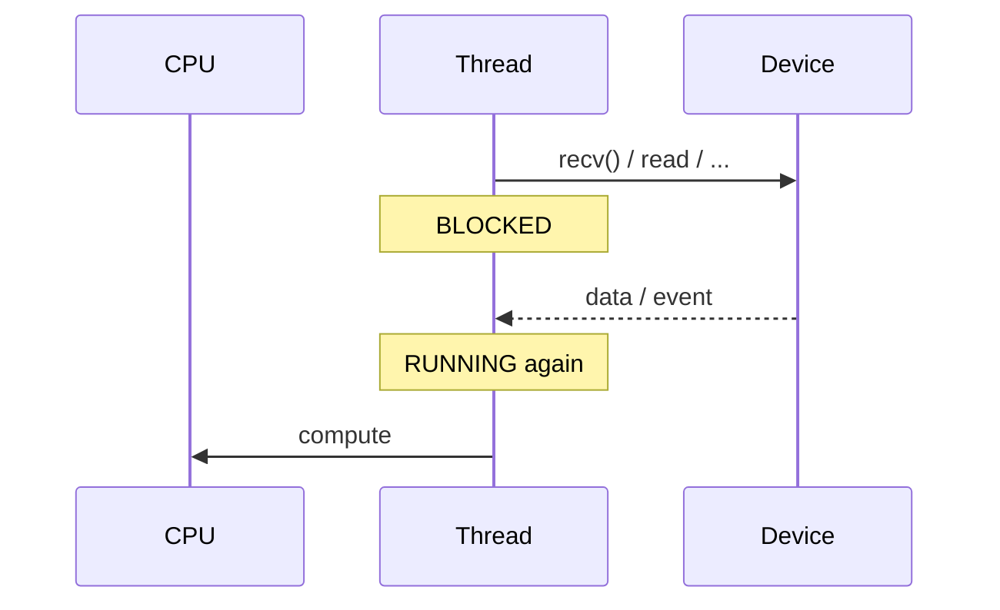

### 2.2. CPU‑bound и I/O‑bound: откуда берётся ускорение

Задачи можно грубо разделить по тому, **что ограничивает скорость**:

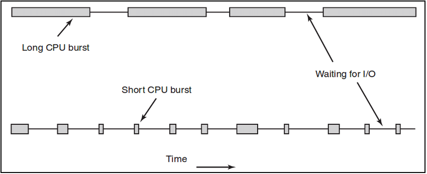

| Тип | Описание | Как ускорять |
|-----|----------|--------------|
| **CPU‑bound** | Почти всё время идёт вычисление; блокирований мало. Скорость ограничена CPU. | **Параллелизм**: запуск независимых частей на нескольких ядрах (например, `multiprocessing`). |
| **I/O‑bound** | Потоки часто блокируются на ввод‑выводе (сеть, диск). Скорость ограничена внешними событиями. | **Оптимизация блокирования**: переключение на другую задачу, пока одна ждёт   потоки или **asyncio**. |

Это не жёсткие категории, а спектр. Выбор инструмента (процессы, потоки, asyncio) зависит от того, больше ли в вашей задаче вычислений или ожиданий ввода‑вывода.

**Параллельная работа и параллелизм**:


- **Параллельная работа (concurrency):** несколько логических задач продвигаются вперёд за счёт **переключения**; в каждый момент времени может работать только одна. Как гроссмейстер, который обходит много досок: пока один соперник думает, он делает ход на другой доске.

- **Параллелизм:** несколько инструкций реально выполняются **одновременно** (например, на разных ядрах). В CPython настоящий параллелизм даёт только запуск нескольких процессов: каждый процесс имеет свой интерпретатор и свой GIL.

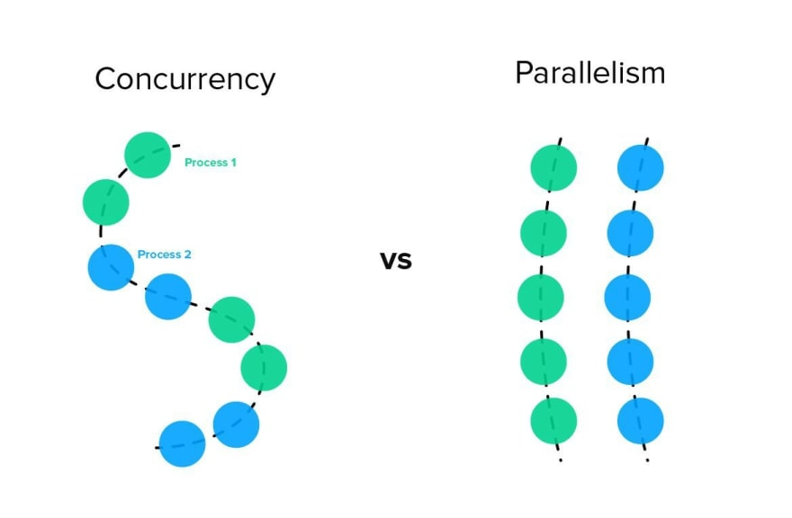

### 2.3. От одного клиента к многим

Простой TCP‑сервер echo:

- вызывает `accept()`, чтобы принять соединение от клиента;
- входит во внутренний цикл `recv() → send()` для этого клиента;
- только **после** отключения клиента возвращается к `accept()`.

То есть в такой схеме **полностью обслуживается только один клиент**: пока сервер заблокирован в `recv()` для клиента A, он не может вызвать `accept()` для клиента B.

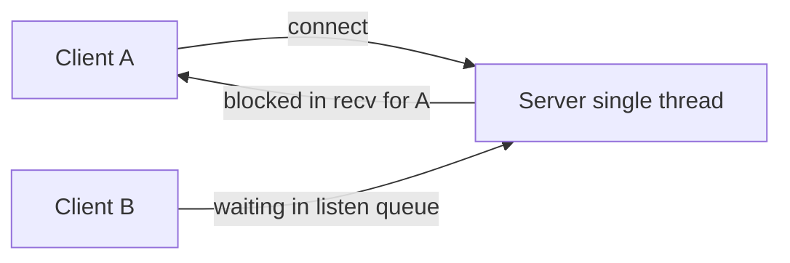

Чтобы обслуживать много клиентов одновременно, нужна **параллельная работа**:

- **потоки**: несколько потоков управления в одном процессе, общая память; когда один поток блокируется в `recv()`, другой может выполняться (оптимизация блокирующего ввода‑вывода);
- **процессы**: отдельные адресные пространства, могут работать действительно параллельно на нескольких ядрах; удобно для CPU‑bound задач;
- **asyncio**: однотредовый цикл событий, много корутин, которые по очереди отдают управление в точках `await`; блокирующих системных вызовов внутри корутин быть не должно.

### 2.4. Процессы и потоки (подробно)

| Аспект | Процессы | Потоки |
|--------|----------|--------|
| **Память** | Изолирована; у каждого процесса своё адресное пространство. | Общая; все потоки в процессе разделяют память (переменные, кучу). |
| **Создание** | Тяжёлое: новый процесс + новый интерпретатор (в Python). | Лёгкое: новый интерпретатор не создаётся. |
| **Управление** | Создаёт и планирует ОС (вытесняющая многозадачность). | В Python используются потоки ОС; планирование тоже вытесняющее. |
| **GIL (CPython)** | У каждого процесса свой интерпретатор → **нет общего GIL между процессами** → возможен настоящий параллелизм. | Один GIL на процесс → в каждый момент времени только один поток выполняет байткод Python → **нет настоящего CPU‑параллелизма** для потоков. |

*GIL (Global Interpreter Lock) относится к CPython; другие реализации Python могут вести себя иначе.*

Итого: используйте **процессы**, когда нужен реальный прирост за счёт нескольких ядер; используйте **потоки** или **asyncio** для I/O‑bound задач (много соединений, ожидание сети/диска).

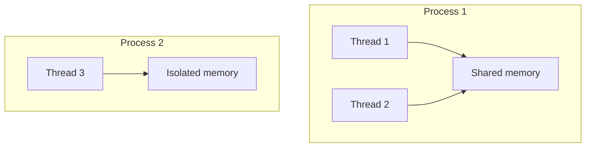

### 2.5. Что может пойти не так: состояние гонки и блокировки

**Недостатки многозадачности (кратко):** (1) часть алгоритмов по сути последовательные и плохо делятся на независимые части; (2) переключение контекста и создание задач стоят ресурсов, ускорение никогда не идеально линейное; (3) общие ресурсы заставляют думать о **потокобезопасности**; (4) ошибки могут проявляться редко и нерегулярно (порядок планирования не детерминирован).

Если несколько потоков используют **общие ресурсы** (переменные, файлы, сокеты), порядок их действий не фиксирован. Один поток может прочитать значение, второй успеет его изменить до того, как первый использует, и программа будет работать неверно. Это **состояние гонки**.

**Пример:** два потока снимают деньги с одного счёта. Баланс 50; каждый хочет снять 30. Логика: «если баланс ≥ сумма, вычесть сумму». Оба потока проходят проверку (50 ≥ 30) и оба вычитают 30. Порядок выполнения не фиксирован: итоговый баланс может стать 20 (если оба записали 20, последняя запись побеждает) .

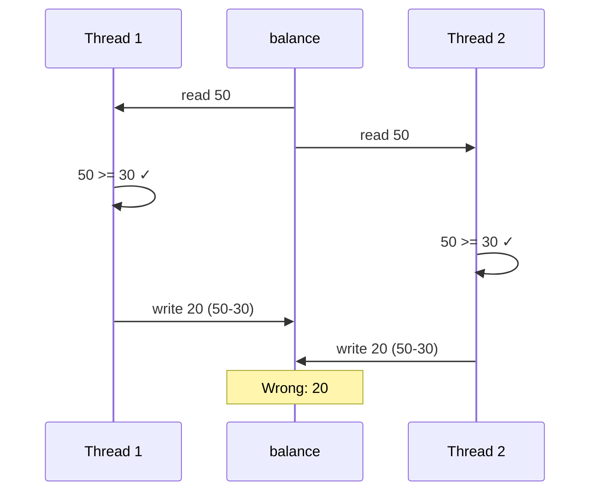

**Потокобезопасность** означает, что программа ведёт себя корректно даже при одновременном доступе из нескольких потоков. Чтобы защитить общие ресурсы, используют **блокировки**:

- **Блокировка (lock):** в каждый момент времени только один поток может удерживать блокировку. Перед доступом к общему ресурсу поток **захватывает** её (acquire); по окончании   **освобождает** (release). Остальные потоки блокируются, пока блокировка не освободится. Операции захвата и освобождения атомарны.
- Обычно используют по одной блокировке на общий ресурс (или на критическую секцию). Все потоки, которые обращаются к этому ресурсу, должны использовать одну и ту же блокировку.

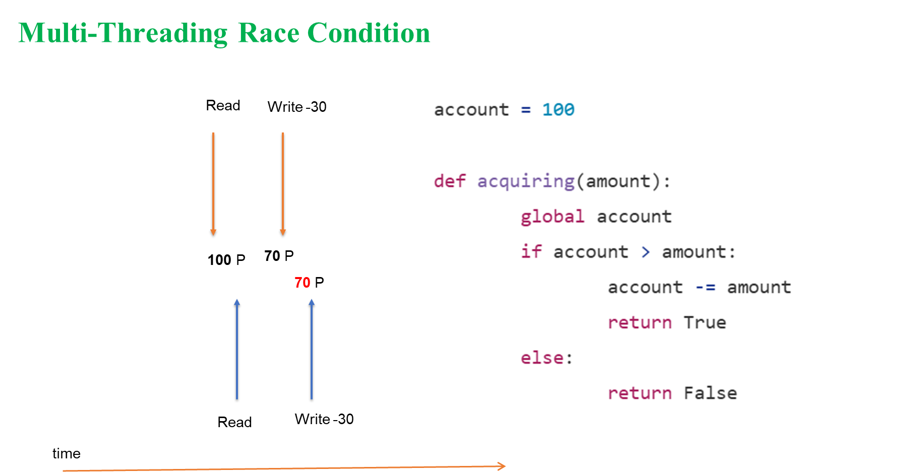  
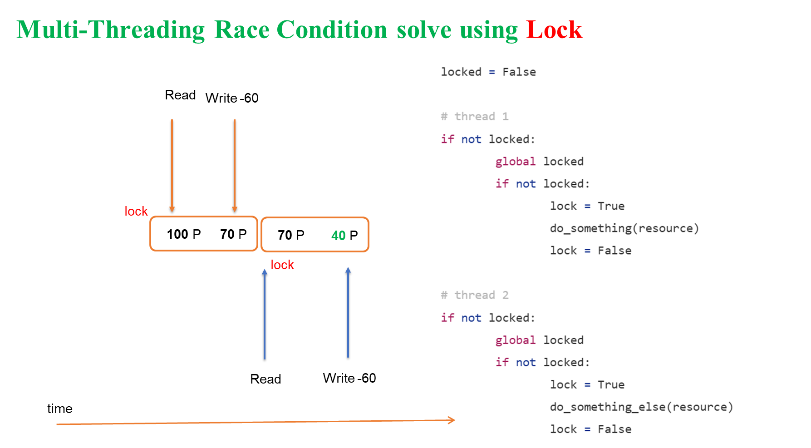

**Взаимная блокировка (deadlock):** два потока каждый держит свою блокировку и ждёт блокировку другого. Чтобы этого избежать, берите блокировки всегда в **одинаковом глобальном порядке** (например, сначала A, потом B, и никогда наоборот).  
- Старайтесь держать блокировку только на **минимальной критической секции**; если держать её слишком долго, потоки будут по сути выполняться по очереди, и выигрыш от многозадачности исчезнет.

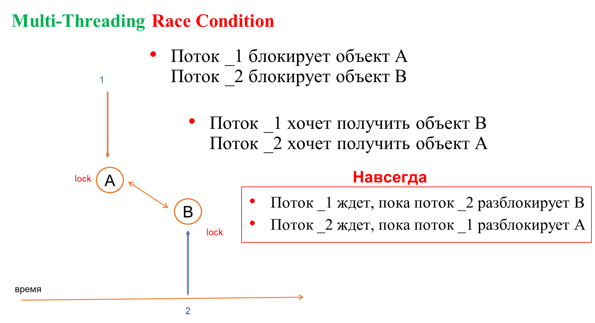

В Python обычно используют `threading.Lock()` и конструкцию `with lock:` для работы с блокировками.

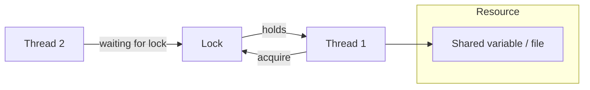

### 2.6. Инструменты Python: потоки, процессы, asyncio

| Аспект | Процессы | Потоки | Asyncio |
|--------|----------|--------|---------|
| **Многозадачность** | Вытесняющая (ОС) | Вытесняющая (через потоки ОС) | **Кооперативная** (передача управления в точках `await`) |
| **Использование нескольких ядер** | Да | Нет (GIL) | Нет |
| **Масштабируемость** | Низкая (десятки; запуск процессов дорогой) | Средняя (сотни потоков) | Высокая (тысячи корутин) |
| **Обычный блокирующий I/O** | Можно использовать | Можно использовать | **Нельзя**   нужны async‑API |
| **GIL** | Нет общего GIL между процессами | Есть (один GIL на процесс) | Тот же GIL; одна нить выполнения, конкуренции за GIL нет |

- **Ускорение CPU‑bound‑задач** → только **multiprocessing** даёт реальный параллелизм в CPython.
- **I/O‑bound‑код, который уже написан с блокирующими вызовами** → удобнее всего запускать в нескольких потоках (`threading`).
- **Много I/O‑bound‑задач (например, тысячи соединений)** → лучше подходит **asyncio** и неблокирующие / асинхронные API.

*Замечание.* Функции мультиплексирования ввода‑вывода `select()` и `poll()`   **синхронные** (блокирующие до готовности одного из дескрипторов). Они не равны модели async/await. В asyncio используется цикл событий и кооперативная передача управления; реализация может опираться на `select` на части платформ, но программист работает в асинхронной модели.

*Таблица частично основана на [Коротеев, «Многозадачное программирование»](https://koroteev.site/text/os34-0/).*

### 2.7. Потоки, процессы и asyncio (обзор)

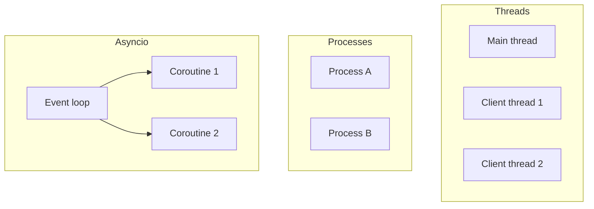

| Модель | Тип многозадачности | Работа с памятью | Лучше всего подходит для |
|--------|----------------------|------------------|---------------------------|
| Потоки | Потоки ОС в одном процессе | Общая память | I/O‑bound‑задачи (сеть, диск) |
| Процессы | Несколько процессов | Память не общая (нужен IPC) | CPU‑bound‑вычисления |
| Asyncio | Однотредовый цикл событий | Общая память одного процесса | Много I/O‑bound‑соединений |

---

## 3. Структура работы

Создайте папку примерно такого вида:

```text
lab14_concurrency/
├── part1_threaded_server/
│   ├── server_seq.py
│   ├── server_threaded.py
│   └── client.py
├── part2_port_scanner/
│   ├── scanner_seq.py
│   └── scanner_threaded.py

└── answers.txt
```

Вы должны **реализовать все файлы Python** и заполнить файл **`answers.txt`** (ответы и наблюдения).

---

## 4. Ссылки

- **Понятия и терминология:** [Многозадачное программирование](https://koroteev.site/text/os34-0/) (М. Коротеев)   блокирование потоков, CPU‑bound и I/O‑bound, процессы и потоки, состояния гонки, блокировки, сравнение инструментов Python.

---

## 5. Часть 1: многопоточный TCP echo‑сервер

### 5.1. Задание 1: последовательный echo‑сервер (`server_seq.py` + `client.py`)

**Цель:** собрать простой echo‑сервер и клиент, чтобы **почувствовать блокирующий ввод‑вывод** до добавления потоков.

1. Реализуйте `server_seq.py`: привяжите сокет к `0.0.0.0:4444`; в цикле: `accept()` → внутренний цикл `recv()`; если получены пустые данные (закрытие соединения) или сообщение `'exit'`   закрыть соединение и выйти из цикла; иначе отправить те же байты обратно клиенту.
2. Реализуйте `client.py`: подключение к `127.0.0.1:4444`; цикл ввода строк; если введено `'exit'`   отправить и закрыть соединение; иначе отправить и вывести ответ сервера.
3. **Эксперимент A.** Запустите сервер, подключите одного клиента, затем запустите второго клиента, пока первый ещё подключён. Наблюдение: второй клиент ждёт. Опишите это в `answers.txt`.

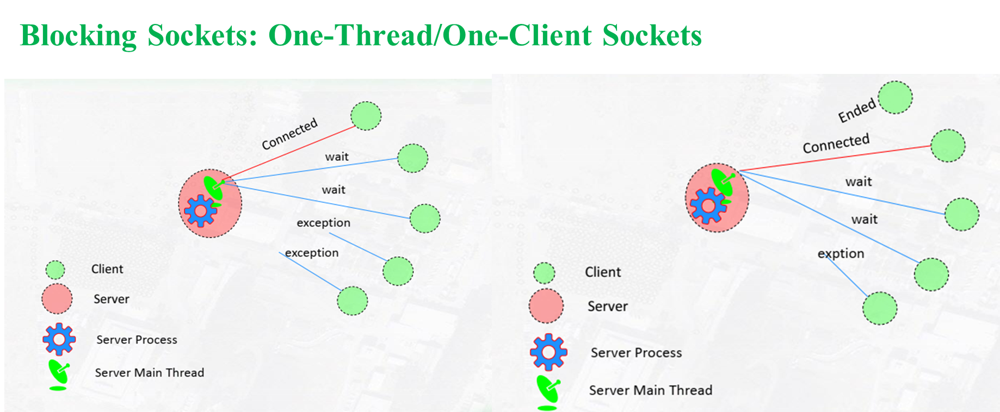

**Пример `server_seq.py`:**

```python
import socket

HOST = "0.0.0.0"
PORT = 4444

def handle_client(conn, addr):
    print("Connected:", addr)
    try:
        while True:
            data = conn.recv(1024)
            if not data:
                break
            message = data.decode()
            print("Received from {}: {}".format(addr, message))
            conn.sendall(data)
            if message == "exit":
                break
    finally:
        print("Closing connection:", addr)
        conn.close()

def main():
    ss = socket.socket(socket.AF_INET, socket.SOCK_STREAM)
    ss.setsockopt(socket.SOL_SOCKET, socket.SO_REUSEADDR, 1)
    ss.bind((HOST, PORT))
    ss.listen(5)
    print("Sequential server listening on {}:{}".format(HOST, PORT))

    while True:
        conn, addr = ss.accept()
        # Blocking: we stay inside handle_client until this client is done
        handle_client(conn, addr)

if __name__ == "__main__":
    main()
```

**Пример `client.py`:**

```python
import socket

HOST = "127.0.0.1"
PORT = 4444

def main():
    sock = socket.socket(socket.AF_INET, socket.SOCK_STREAM)
    sock.connect((HOST, PORT))
    print("Connected to {}:{}".format(HOST, PORT))

    try:
        while True:
            msg = input("Enter message (or 'exit'): ")
            if not msg:
                continue
            sock.sendall(msg.encode())
            if msg == "exit":
                break
            data = sock.recv(1024)
            if not data:
                print("Server closed connection")
                break
            print("Echo from server:", data.decode())
    finally:
        sock.close()

if __name__ == "__main__":
    main()
```

**Пояснение.** В последовательном сервере вызов `handle_client` блокирует основной цикл: сервер не возвращается к `accept()`, пока не закончит обслуживание текущего клиента. Новые подключения ждут в очереди `listen`. Это базовая точка отсчёта для сравнения с многопоточным сервером.

### 5.2. Задание 2: сервер «поток на клиента» (`server_threaded.py`)

Завершите заготовку `server_threaded.py`, используя комментарии TODO и подсказки, затем выполните Эксперимент B.

Основной процесс и основной поток принимают подключения; **каждый клиент обслуживается в отдельном потоке**. В заготовке ниже как раз не хватает кода, который делает сервер многоклиентским: после `accept()` нужно создать новый поток, а не вызывать `handle_client` напрямую (см. §2.3–2.4).

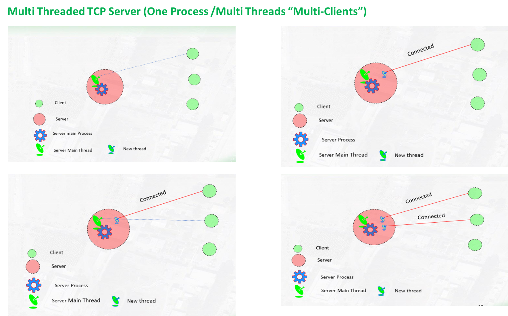

> **Заготовка**   допишите TODO (2 строки), чтобы каждый клиент обслуживался в отдельном потоке.

```python
import socket
import threading

def handle_client(conn, addr):
    print("New connection:", addr)
    try:
        while True:
            data = conn.recv(1024)
            if not data:
                break
            message = data.decode()
            print("Received from {}: {}".format(addr, message))
            conn.sendall(data)
            if message == "exit":
                break
    finally:
        conn.close()

ss = socket.socket(socket.AF_INET, socket.SOCK_STREAM)
ss.setsockopt(socket.SOL_SOCKET, socket.SO_REUSEADDR, 1)
ss.bind(("0.0.0.0", 4444))
ss.listen(5)
print("Threaded server listening on 0.0.0.0:4444")

while True:
    conn, addr = ss.accept()
    # TODO (студент): допишите следующие 2 строки так, чтобы каждый клиент обслуживался в отдельном потоке.
    # Подсказка (§2.3–2.4): НЕ вызывайте здесь handle_client(conn, addr) напрямую   это заблокирует основной поток.
    # Создайте объект threading.Thread с target=handle_client и args=(conn, addr), затем вызовите у него .start().
    # Основной поток должен сразу вернуться к accept(), чтобы принять следующих клиентов; новый поток выполнит handle_client.
    # ... (добавьте здесь свои 2 строки)
```

**Эксперимент B.** Запустите `server_threaded.py`, затем откройте несколько экземпляров `client.py` (в двух‑трёх терминалах). Убедитесь, что все клиенты получают ответы одновременно, не ожидая завершения других. Опишите наблюдения в `answers.txt`.

**Почему это работает.** Каждый клиент обрабатывается в своём потоке. Когда один поток блокируется на `recv()`, ОС может выполнить другой поток (например, поток, обслуживающий другого клиента, или основной поток, выполняющий `accept()`). Это и есть **оптимизация блокирующих операций**: процессор не простаивает во время ожидания ввода‑вывода. В этой схеме единственное общее состояние   слушающий сокет; каждый `conn` используется только одним потоком, поэтому для ввода‑вывода по отдельному соединению блокировки не нужны. Если позже вы добавите общее состояние (например, глобальный счётчик или общий буфер лога), его нужно будет защищать блокировкой.

### 5.3. Вопросы (добавьте в `answers.txt`)

1. Почему однопоточный сервер может полноценно обслуживать только одного клиента за раз?  
2. В модели «поток на клиента» что делает основной поток, пока работают клиентские потоки?  
3. Что такое состояние гонки? Приведите простой пример, связанный с общим состоянием в многопоточном сервере.  
4. Почему нужно быть осторожным, когда несколько потоков обращаются к общим переменным?

### 5.4. Дополнительное задание: сервер на процессах (`server_process.py`)

По желанию реализуйте `server_process.py`, используя модуль `multiprocessing` вместо `threading`. Идея: для каждого клиента запускать отдельный процесс. Сравните поведение и накладные расходы с сервером на потоках.

---

## 6. Часть 2   параллельный сканер TCP‑портов (потоки)

### 6.1. Задание 3: последовательный сканер портов (`scanner_seq.py`)

Попросите пользователя ввести хост; для каждого порта в диапазоне (например, 4440–4450) попробуйте установить TCP‑соединение. Если соединение удалось   выведите `Port N is OPEN`; затем закройте сокет. При желании измеряйте время работы.

**Пример `scanner_seq.py`:**

```python
import socket
import time

def scan_port(host, port, timeout=0.5):
    sock = socket.socket(socket.AF_INET, socket.SOCK_STREAM)
    sock.settimeout(timeout)
    try:
        sock.connect((host, port))
        return True
    except (socket.timeout, ConnectionRefusedError, OSError):
        return False
    finally:
        sock.close()

def main():
    host = input("Host to scan (e.g. 127.0.0.1): ").strip()
    start_port = 4440
    end_port = 4450

    print("Sequential scan of {} ports {}-{}...".format(host, start_port, end_port))
    t0 = time.time()
    for port in range(start_port, end_port + 1):
        if scan_port(host, port):
            print("Port {} is OPEN".format(port))
    t1 = time.time()
    print("Sequential scan finished in {:.2f} seconds".format(t1 - t0))

if __name__ == "__main__":
    main()
```

**Пояснение.** Сканер прост, но при многих закрытых портах работает медленно: каждый `connect()` блокируется до установления соединения или до таймаута. Пока один вызов заблокирован, другие порты не проверяются.

### 6.2. Задание 4: многопоточный сканер портов (`scanner_threaded.py`)

Завершите заготовку `scanner_threaded.py`, используя комментарии TODO и подсказки, затем запустите сканер и зафиксируйте результаты. Вам нужно добавить общее состояние (список открытых портов + блокировка), создать по одному потоку на порт и дождаться завершения всех потоков перед выводом результата (см. §2.2 про I/O‑bound и §2.5 про блокировки).

> **Заготовка**   допишите TODO в `main()`: список результатов, блокировка, список потоков; цикл по портам с созданием потоков; join и вывод.

```python
import socket
import threading
import time

def scan_port(host, port, results, lock, timeout=0.5):
    # Create a new socket for each thread (don't share the global one)
    sock = socket.socket(socket.AF_INET, socket.SOCK_STREAM)
    sock.settimeout(timeout)
    try:
        sock.connect((host, port))
        is_open = True
    except (socket.timeout, ConnectionRefusedError, OSError):
        is_open = False
    finally:
        sock.close()

    if is_open:
        # Protect shared list with a lock (see §2.5 race conditions and locks)
        with lock:
            results.append(port)

def main():
    host = input("Host to scan (e.g. 127.0.0.1): ").strip()
    start_port = 4440
    end_port = 4450

    # TODO (студент): создайте пустой список для результатов и объект threading.Lock().
    # Также создайте пустой список для хранения объектов потоков.
    # Подсказка (§2.5): общий список results должен всегда изменяться под блокировкой, когда в него пишут несколько потоков.
    results=?
    lock = ?
    threads = ?
    
    print("Threaded scan of {} ports {}-{}...".format(host, start_port, end_port))
    t0 = time.time()

    # TODO (студент): пройдитесь по каждому порту в диапазоне range(start_port, end_port + 1).
    # Для каждого порта создайте threading.Thread с target=scan_port и args=(host, port, results, lock);
    # запустите поток методом .start() и добавьте его в список threads.
    # Подсказка (§2.2): пока один поток ждёт connect/timeout, другие потоки могут проверять другие порты   так сканер работает быстрее.
    for port in range( ?  , ?):
        t = thread??.???(target=???, args=(?????))
        t.start()
        threads.append(?)

    # TODO (студент): дождитесь окончания всех потоков (join для каждого потока), затем вычислите затраченное время.
    # Выведите каждый открытый порт в отсортированном порядке, затем выведите общее время сканирования.
    # Подсказка: без join() главный поток может завершиться раньше, чем закончат работу рабочие потоки.
    for t in threads:
        t.?()
    
    t1 = time.time()
    
    # Print results
    print("\nOpen ports:")
    for port in sorted(results):
        print(f"  Port {port} is open")
    
    print(f"\nScan completed in {t1 - t0:.2f} seconds")

if __name__ == "__main__":
    main()
```

**Пояснение.** Каждый порт проверяется в своём потоке. Пока один поток блокируется на `connect()` (ожидание или таймаут), другие потоки проверяют иные порты   так сканирование ускоряется. Единственное общее состояние   список `results`; доступ к нему защищён блокировкой, чтобы избежать состояния гонки (см. §2.5).

### 6.3. Вопросы (добавьте в `answers.txt`)

1. Как потоки помогают ускорить сканер портов по сравнению с последовательной версией?  
2. Почему безопасно проверять разные порты параллельно?  
3. Зачем может понадобиться блокировка, если несколько потоков добавляют данные в общий список `results`?  
4. В каких ситуациях многопоточный сканер может оказаться **медленнее** последовательного?

### 6.4. Запуск и фиксация результатов

> Перед сдачей работы запустите готовые программы и зафиксируйте, что вы наблюдаете.

- **Часть 1   многопоточный сервер.** Запустите `server_threaded.py`. Откройте два или больше экземпляров `client.py` (например, в двух окнах терминала). Отправьте сообщения из каждого клиента и убедитесь, что **все клиенты получают ответы**, не ожидая завершения других. Запишите в `answers.txt` что‑то вроде: *«Многопоточный сервер: запущено 2 клиента; оба могли отправлять сообщения одновременно, ответы приходили параллельно».*  
- **Часть 2   сканер портов.** Запустите `scanner_threaded.py` для какого‑то хоста (например, `127.0.0.1`) и указанного диапазона портов. Запишите в `answers.txt`, какие порты оказались открыты и сколько времени заняло сканирование. При желании сравните с временем работы `scanner_seq.py`.  
- **Проверка преподавателя.** На вашем компьютере преподаватель проверит: (1) что **многопоточный сервер** действительно обслуживает **несколько клиентов одновременно**, и (2) что **параллельный сканер портов** показывает открытые порты и время работы (и, желательно, быстрее версии без потоков).

---

## 7. Что сдавать

> **Покажите преподавателю (на своём компьютере):**

| № | Что сдать | Примечание |
|---|-----------|------------|
| 1 | `answers.txt` | Письменные ответы и наблюдения по всем вопросам и результаты запусков (см. [§6.4](#64-запуск-и-фиксация-результатов)). |
| 2 | **Работающий многопоточный сервер** | Обслуживает несколько клиентов одновременно. |
| 3 | **Работающий параллельный сканер портов** | Показывает открытые порты и время работы. Преподаватель проверит оба варианта на вашем компьютере. |

---

## 8. Пример оценки (можно настроить под курс)

| Компонент | Доля |
|-----------|------|
| `answers.txt` | 35 % |
| Многопоточный сервер и сканер портов | 65 % |

> Важно не только, чтобы код работал, но и чтобы вы понимали, **как** используются потоки, процессы и asyncio.

